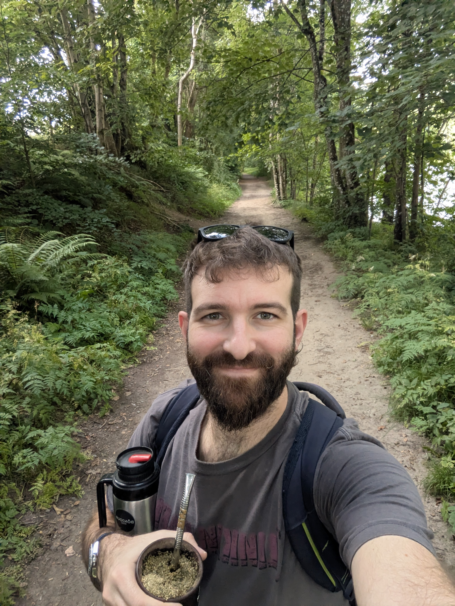

# Sobre mi

{ width="250" style="border-radius: 10px; display: block; margin: 0 auto;" }

Mi nombre es Santiago Rostán Talasimov, tengo 34 años, nací en Mercedes, Soriano, pero crecí en el campo cerca de Fray Bentos.

En 2010 me mudé a Montevideo para estudiar Química Farmacéutica, y en 2016 me anoté a la Licenciatura en Química. En 2018 me recibí de Licenciado y empecé mi Doctorado en Química. Me recibí en 2023 de Q. Farmacéutico y en 2025 terminé mi Doctorado. La disciplina en la que hice mi tesis doctoral es la Química Inorgánica Medicinal, una rama del desarrollo de materiales, con particular aplicación en medicina.

Actualmente soy Investigador y Docente en el Área Química Inorgánica de la Facultad de Química de la Universidad de la República. Doy clases en 1ero de Facultad, en las asignaturas masivas Química General I, Química General II y Química Inorgánica y también en asignaturas avanzadas de menor concurrencia. Mi linea de investigación actual son las nanoparticulas de oro como nanovehículos de fármacos.

En cuanto a mi interés por EFDI, todo empezó cuando junto con mi compañera Analía (que también hace EFDI este año) fundamos un pequeño emprendimiento PrintLab.uy en 2024 ya que nos interesamos por la Impresión 3D primero y el diseño luego. No sabíamos nada de diseño asi que estudiamos en Youtube de forma autodidacta. El año pasado decidimos postular a las becas para hacer la EFDI ya que queríamos formalizar y adquirir nuevos conocimientos.

Espero de esta especialización aprender mucho y llevarme habilidades, conocimientos y compañeros para seguir creciendo tanto en lo personal como en lo profesional.